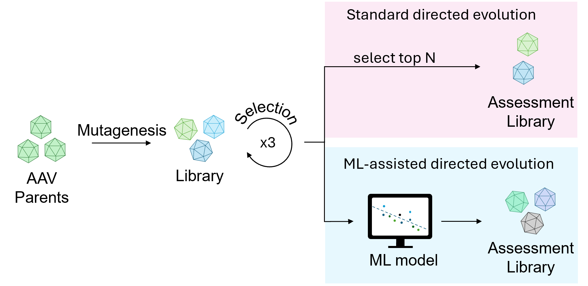

# Machine learning-assisted directed evolution yields dramatic improvement on novel AAV engineering task
---
<p align="center">
  
</p>

This repository provides source code to reproduce, verify and extend the study "Machine learning-assisted directed evolution yields dramatic improvement on novel AAV engineering task". Source data files necessary to reproduce the manuscript figures are provided on NCBI SRA (https://www.ncbi.nlm.nih.gov/bioproject/1473000).

## Abstract

Directed evolution enables the discovery of protein mutants with improved fitness through iterative rounds of selection and has been widely applied to adeno-associated virus (AAV) capsid engineering. Machine learning (ML) can augment this process by prioritising mutants for experimental validation, but whether its benefits outweigh the added cost of ML-designed library construction remains unclear. Here, we address this question by considering improvements in manufacturing efficiency of AAV capsids in the context of exosomal encapsulation, which is a technique for improving AAV immunogenicity. We generated a directed evolution dataset comprising 53,974 mutants across three rounds of selection and an independent assessment dataset of 472 ML-designed mutants with detailed profiling. Directed evolution alone yielded a 3-fold improvement, while ML yielded a further 15-fold improvement in manufacturing efficiency. We show that data quality – specifically the number of selection rounds and the statistical power of mutant counts – has a greater impact on model performance than model architecture. Together, the combination of ML and directed evolution substantially improved manufacturing efficiency of AAV exosomal encapsulation, with a 45-fold overall improvement, demonstrating that ML-assisted directed evolution outperforms directed evolution alone. Finally, we provide practical guidance on experimental design and implementation of ML tuning strategies that can augment model performance in protein engineering applications.  

---

## Requirements

The requirements to run the data processing, model training and analysis are included in the ml_assisted_aav_env.yaml file. A conda environment can be created from this file with
```bash
conda env create -f ml_assisted_aav_env.yaml
```
Installing the environment from the yaml file can take several minutes.

## Example NGS processing

<p align="center">
  
</p>

Example configuration and input to run NGS data processing and calculate the log enrichment score S are included in example/raw_NGS_files. A small test set (10 reads, example/raw_NGS_files/example_test) can be run from the root directory via the following commands:
```bash
python 3 2_align_and_merge_paired_end_reads.py - example/raw_NGS_files/example_test
```
This test took less than 20? seconds to run with 1? CPU (on Linux and Windows). The expected outputs are included in example/raw_NGS_files/outputs/enrichment_scores.csv.

For more information, see example/raw_NGS_files/raw_NGS_files/.

## Example training
```text
├── 1_combine_FASTQ_files.bash
├── 2_align_and_merge_paired_end_reads.py
├── 3_filter_and_trim_reads.bash
├── 4_calculate_mutant_counts.py
├── 5_calculate_log_enrichment_score.py
├── 6_combine_datasets_across_replicates.py
├── 7_translate_nucleotide_sequence.py
│
├── make_figure_2a_and_supplementary_figure_S1a.ipynb
├── make_figure_2b_and_supplementary_figure_S1b.ipynb
├── make_figure_2c.py
├── make_figure_2d.py
├── make_figure_3a.ipynb
├── make_figure_3b.ipynb
├── make_figure_4a.ipynb
├── make_figure_4b.ipynb
├── make_figure_4c.ipynb
├── make_figure_4d.ipynb
├── make_supplementary_figure_S2a.ipynb
├── make_supplementary_figure_S2b.ipynb
└── make_supplementary_figure_S3a_and_b.ipynb
```

---

## Software Dependencies

## Operating Systems

The pipeline has been tested on:

* Linux (Ubuntu 20.04+ recommended)
* macOS (Apple Silicon and Intel)

Windows users are encouraged to use:

* Windows Subsystem for Linux (WSL2)

### Python

Recommended:

```bash
Python >= 3.10
```

### Required Python Packages

```bash
pandas
numpy
matplotlib
seaborn
scikit-learn
biopython
tqdm
openpyxl
tensorflow
keras
jupyter
```

Install with:

```bash
pip install pandas numpy matplotlib seaborn scikit-learn biopython tqdm openpyxl tensorflow keras notebook
```

### External Software

Depending on the trimming and preprocessing scripts, additional command-line tools may be required:

```bash
bash
gzip
```

Add any additional dependencies here:

```text
cutadapt
fastp
seqtk
...
```

---

## Installation

### Clone Repository

```bash
git clone https://github.com/USERNAME/REPOSITORY.git
cd REPOSITORY
```

### Create a Virtual Environment

```bash
python -m venv env
source env/bin/activate
```

### Install Dependencies

```bash
pip install -r requirements.txt
```

or

```bash
pip install pandas numpy matplotlib seaborn scikit-learn biopython tqdm openpyxl tensorflow keras notebook
```

---

## Input Data Structure

Expected directory structure:

```text
data/
├── FASTQ/
│   └── ml_assessment_library/
│       ├── sample_1/
│       ├── sample_2/
│       └── ...
│
├── Excel/
└── plots/
```

Place raw paired-end FASTQ files in the appropriate input directory before running the pipeline.

---

## Running the Pipeline

Run each step sequentially.

### Step 1: Combine FASTQ Files

```bash
bash 1_combine_FASTQ_files.bash
```

### Step 2: Align and Merge Paired-End Reads

```bash
python 2_align_and_merge_paired_end_reads.py
```

### Step 3: Filter and Trim Reads

```bash
bash 3_filter_and_trim_reads.bash
```

### Step 4: Calculate Variant Counts

```bash
python 4_calculate_mutant_counts.py
```

### Step 5: Calculate Enrichment Scores

```bash
python 5_calculate_log_enrichment_score.py
```

### Step 6: Combine Replicate Datasets

```bash
python 6_combine_datasets_across_replicates.py
```

### Step 7: Translate Nucleotide Sequences

```bash
python 7_translate_nucleotide_sequence.py
```

---

## Generating Figures

Main figures:

```bash
jupyter notebook make_figure_2a_and_supplementary_figure_S1a.ipynb
jupyter notebook make_figure_2b_and_supplementary_figure_S1b.ipynb

python make_figure_2c.py
python make_figure_2d.py

jupyter notebook make_figure_3a.ipynb
jupyter notebook make_figure_3b.ipynb

jupyter notebook make_figure_4a.ipynb
jupyter notebook make_figure_4b.ipynb
jupyter notebook make_figure_4c.ipynb
jupyter notebook make_figure_4d.ipynb
```

Supplementary figures:

```bash
jupyter notebook make_supplementary_figure_S2a.ipynb
jupyter notebook make_supplementary_figure_S2b.ipynb
jupyter notebook make_supplementary_figure_S3a_and_b.ipynb
```

Generated figures will be saved to:

```text
plots/
```

---

## Outputs

The pipeline generates:

* Processed FASTQ files
* Variant count tables
* Enrichment score datasets
* Amino acid sequence annotations
* Publication-quality figures
* Machine learning model evaluation results

---

## Citation

If you use this repository, please cite:

```text
Author et al., Year.
Title.
Journal.
DOI
```

---

# Contact

Name: YOUR NAME

Email: [your.email@institution.edu](mailto:your.email@institution.edu)
