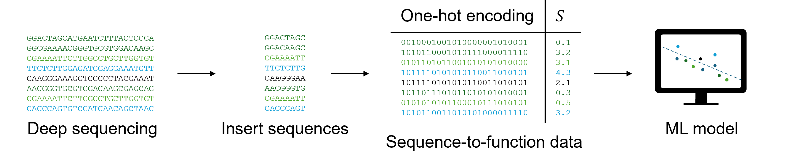

# Machine learning-assisted directed evolution yields dramatic improvement on novel AAV engineering task
---
<p align="center">
  
</p>

This repository provides source code to reproduce, verify and extend the study "Machine learning-assisted directed evolution yields dramatic improvement on novel AAV engineering task". Source data files necessary to reproduce the manuscript figures are provided on NCBI SRA (https://www.ncbi.nlm.nih.gov/bioproject/1473000).

## Abstract

Directed evolution enables the discovery of protein mutants with improved fitness through iterative rounds of selection and has been widely applied to adeno-associated virus (AAV) capsid engineering. Machine learning (ML) can augment this process by prioritising mutants for experimental validation, but whether its benefits outweigh the added cost of ML-designed library construction remains unclear. Here, we address this question by considering improvements in manufacturing efficiency of AAV capsids in the context of exosomal encapsulation, which is a technique for improving AAV immunogenicity. We generated a directed evolution dataset comprising 53,974 mutants across three rounds of selection and an independent assessment dataset of 472 ML-designed mutants with detailed profiling. Directed evolution alone yielded a 3-fold improvement, while ML yielded a further 15-fold improvement in manufacturing efficiency. We show that data quality – specifically the number of selection rounds and the statistical power of mutant counts – has a greater impact on model performance than model architecture. Together, the combination of ML and directed evolution substantially improved manufacturing efficiency of AAV exosomal encapsulation, with a 45-fold overall improvement, demonstrating that ML-assisted directed evolution outperforms directed evolution alone. Finally, we provide practical guidance on experimental design and implementation of ML tuning strategies that can augment model performance in protein engineering applications.  

---

## Requirements
This software was tested under Windows Subsystem for Linux 2 (WSL2; Linux kernel 6.6.114.1) on a workstation equipped with a 13th Generation Intel Core i7-13700H processor and 16GB RAM. No GPU acceleration was used.

The requirements to run the data processing and associated analysis are stored in data_processing.yaml. Meanwhile, the requirements for model training, analysis and visualization can be found in the modelling.yaml. Conda environment can be created from these files using the commands below.
```bash
conda env create -f data_processing.yaml
conda env create -f modelling.yaml
```
Installing the data processing environment from the yaml file can take several minutes, while the modelling environment can take up to an hour.

## Example data processing

<p align="center">
  
</p>

Example input to run NGS data processing and calculate the log enrichment score S are included in example/raw_NGS_files. Small test files (15,145 reads, example/raw_NGS_files/example_L1_R1_cropped.fq) can be run from the root directory via the following commands:
```bash
bash 1_combine_FASTQ_files.bash example/raw_NGS_files example/outputs
python 2_align_and_merge_paired_end_reads.py -i example/outputs -o example/outputs/sample_01
bash 3_filter_and_trim_reads.bash example/outputs
python 4_calculate_mutant_counts.py -i example/outputs -o example/outputs
python 5_calculate_log_enrichment_score.py -i_pre_encapsulation example/outputs/example_variant_count.fastq -i_post_encapsulation example/outputs/example_variant_count.fastq -o example/outputs
```
Alignment and merging are the most time-consuming steps and take ~5 min to run with 4 threads. The expected outputs are included in example/outputs/enrichment_scores.csv.

## Example model training

Example configuration and input files to train and compare sequence-to-function models are included in example/sequence_to_function/. Model training and evaluation can be tested by running the following command:
```bash
python make_figure_2d.py -i example/sequence_to_function/Round_3_Threshold -o example/sequence_to_function
```
Training and evaluating the models takes ~15 min without GPU usage. The expected output will be stored in example/sequence_to_function/plot.png.

## Reproduction instructions

For full reproduction of results, download the source data (https://www.ncbi.nlm.nih.gov/bioproject/1473000) and repeat the steps outlined under example data processing. Next, run the visualization Python scripts and Jupyter notebooks using the resulting enrichment_score.csv as input.

## Contact

Marina Luchner, Department of Engineering Science, University of Oxford

For questions regarding the code, data or analyses presented in this repository, please contact:
[marina.luchner@eng.ox.ac.uk](mailto:marina.luchner@eng.ox.ac.uk)

Bug reports and feature requests are welcome through the GitHub Issues page.
